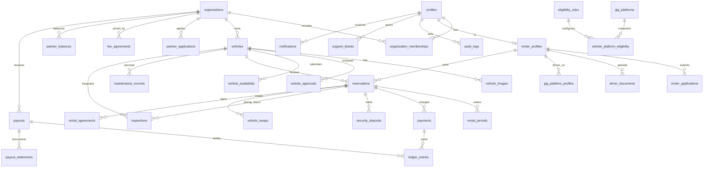

# Entity-Relationship Diagram

## Core tables (grouped)

**Identity & tenancy:** `profiles`, `organizations`, `organization_memberships`, `permissions`, `role_permissions`

**Onboarding:** `partner_applications`, `fleet_management_agreements`, `renter_applications`, `driver_documents`, `gig_platform_profiles`, `gig_platforms`, `eligibility_rules`

**Fleet:** `vehicles`, `vehicle_images`, `vehicle_approvals`, `vehicle_availability`, `vehicle_platform_eligibility`

**Rentals:** `reservations`, `rental_periods`, `rental_renewals`, `vehicle_swaps`, `rental_agreements`, `electronic_signatures`

**Money:** `pricing_rules`, `fee_agreements`, `fee_calculations`, `payments`, `security_deposits`, `refunds`, `chargebacks`, `ledger_entries`, `partner_balances`, `payouts`, `payout_statements`

**Ops:** `maintenance_records`, `inspections`, `damage_reports`, `accident_reports`, `notifications`, `support_tickets`, `audit_logs`
